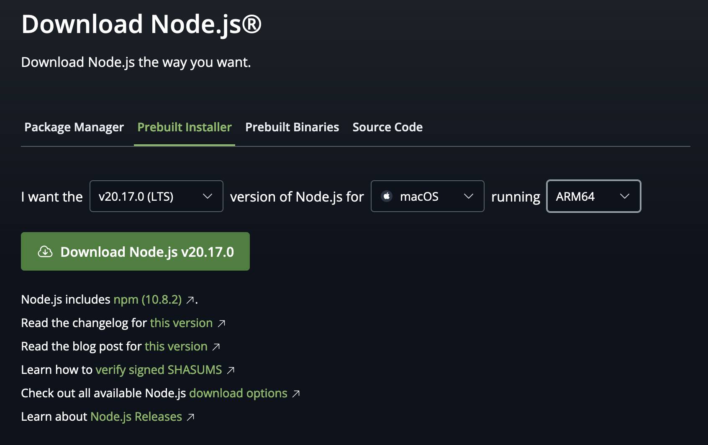

<!-- SPDX-License-Identifier: Apache-2.0 -->

<!-- Markdown rules: https://github.com/DavidAnson/markdownlint/blob/main/doc/Rules.md -->
<!-- markdownlint-disable MD031 MD014 MD040 MD024 MD029 -->

[](https://opensource.org/licenses/Apache-2.0)

# AIU SDK Website

## Description

This repository contains the source code used to build the AIU SDK website. It is built using [Docusaurus](https://docusaurus.io/), a modern static website generator.

The built site is hosted at: https://pages.github.ibm.com/ai-foundation/aiu-sdk-website/

and contains documentation for the [AIU SDK](https://github.ibm.com/ai-foundation/aiu-sdk).

## Contents

- [Installation](#installation)
- [Developing and Testing locally](#developing-and-testing-locally)
- [Build, serve and test site before deployment](#build-serve-and-test-site-before-deployment)
- [Adding documentation content](#adding-documentation-content)
- [Deploying to GitHub pages](#deploying-to-github-pages)
- [Troubleshooting](#troubleshooting)
- [References](#references)
- [Future topics](#future-topics)

---

## Installation

### Pre-requisites

1. Download and install Node.js

    For example, using the pre-built installer:

    - https://nodejs.org/en/download/prebuilt-installer

        

    if unsure which system architecture to select, run `uname -a` from a terminal window:

    ```
    uname -a
    ```

    ```
    Darwin <<user>> 23.4.0 Darwin Kernel Version 23.4.0: Wed Feb 21 21:44:54 PST 2024; root:xnu-10063.101.15~2/RELEASE_ARM64_T6031 arm64
    ```

## Install project code and dependencies 

1. Clone this repository

    ```shell
    git clone git@github.ibm.com:ai-foundation/aiu-sdk-website.git
    ```

1. Change into repository and install dependencies

    ```shell
    cd aiu-sdk-website
    ```

    ```
    npm install
    ```

You are now ready to develop new content!

---

### Developing and testing locally

1. Start the local development server

From within the repository's project root directory, run:

```shell
npm run start
```

This will cause the website code to be compiled and run for development testing:

```
> sdk-website@0.0.0 start
> docusaurus start

[INFO] Starting the development server...
[SUCCESS] Docusaurus website is running at: http://localhost:3000/

✔ Client
  Compiled successfully in 3.22s

client (webpack 5.94.0) compiled successfully

```

It will also attempt (via prompt) to start your system's default browser and connect to the site on `localhost:3000` 

This command starts a local development server and opens up a browser window. Most changes are reflected live without having to restart the server.

--- 

### Adding documentation content

All SDK documentation is authored in markdown and is located under the top-level 'docs' directory.  Under the `docs` directory, you will several subdirectories used to organize the content within the index; for example, the `overview` and `models` subdirectories contain markdown files for those topics.

#### Adding a new page

1. Create a new file under one of the existing subdirectories of the `docs` folder.

    - **Note**: Make sure that top-level header as you want it to appear in the index (i.e., `#`) is the first line of the markdown file.

2. Edit the document and save it

    If the markdown contains new images, please put the new image files in the same subdirectory as the markdown document that references it.

3. Add the new file to the index defined in the `sidebars.js` file.

    If you look inside `sidebars.js` you should see a representation of the left index structure and contents.  It appears as a JS list named `tutorialSidebar`:

    ```javascript
    tutorialSidebar: [
    'welcome',
    'getting-started',
    {
      type: 'category',
      label: 'Overview',
      items: ['overview/overview'],
    },
    {
      type: 'category',
      label: 'Benchmarking',
      items: ['benchmarking/benchmarking'],
    },
    ...
    ```

    as you can see, each "category" represents a set of logical, labeled content that maps to the subdirectories under the `docs` directory.

---

### Build, serve and test site before deployment

1. Build the website

    This following command generates static content into the `build` directory and can be served using any static contents hosting service.

    ```shell
    npm run build
    ```

    A successful build command will produce output similar to: 

    ```
    > sdk-website@0.0.0 build
    > docusaurus build

    [INFO] [en] Creating an optimized production build...

    ✔ Client
    Compiled successfully in 6.22s

    ✔ Server
    Client █████████████████████████ cache (99%) shutdown IdleFileCachePlugin
    stored

    ✔ Server
    [SUCCESS] Generated static files in "build".
    ```

1. Serve the generated website code locally

    ```shell
    npm run serve
    ```  

    you should see the website hosted at `localhost:3000`, but now using the "build" directory contents:

    ```
    > sdk-website@0.0.0 serve
    > docusaurus serve

    [SUCCESS] Serving "build" directory at: http://localhost:3000/
    ```

3. Verify the generated website contents

    - Open [localhost:3000](http://localhost:3000/) in a browser and test the generated website.

---

### Deploying to GitHub pages

**Note**: Only project admins should be deploying website releases to GitHub pages.

In order to deploy the "built" website generated from the `npm run build` command, follow these instructions carefully.

>  
> - The **`'main'`** branch of this repository contains **ONLY** "source" code for the website.
> - The **`'gh-pages'`** branch of this repository contains **ONLY** the built or "generated" assets. 

>  
> For deployment to the `'gh-pages'` branch, it is advised to create a separate local folder to clone the `'gh-pages'` branch into.

1. Clone the `gh-pages` branch into a new folder. We will refer to this repository as the "gh-pages repository" from this point forward to distinguish it from the "source code repository".

    ```shell
    git clone -b gh-pages git@github.ibm.com:ai-foundation/aiu-sdk-website.git
    ```

1. Change into the folder of your local gh-pages repository and verify you are on the `gh-pages` branch

    ```shell
    git branch
    ```

    The `gh-pages` branch should be demarked with an asterisk `*`:

    ```shell
    * gh-pages
    ```

1. Change to the `main` branch of your local clone (which should have the latest, approved website content) and change the `baseUrl` in `docusaurus.config.js`

    Before deploying to GitHub pages all pages MUST be built with the full path name of the target organization and repository. In order to accomplish this, comment out `baseUrl: '/',` and uncomment `baseUrl: '/ai-foundation/aiu-sdk-website/',`:

    ```
    //baseUrl: '/',
    baseUrl: '/ai-foundation/aiu-sdk-website/',
    ```

    **NOTE** You MUST revert the `baseUrl` to root `/` after a successful build and deploy to `gh-pages`.

1. Run `npm run build` with the changed `baseUrl`

1. Copy the contents of the `build` folder *from* the `main` branch of the source code repo (where you you just built the website) *to* the base folder of your local clone of the gh-pages repo (using the `gh-pages` branch).

    >  
    The "build" folder is generated by the `'npm run build'` command on the `'main'` branch locally.  The "build" folder contents should never be committed to `main` and is excluded by `.gitignore` file.

1. Commit the copied changes, then push from your clone of the `gh-pages` branch

    ```shell
    git push origin gh-pages
    ```

1. Verify site has been updated in your browser

    Be sure to *clear your browser cache* and open:
    - https://pages.github.ibm.com/ai-foundation/aiu-sdk-website/

---

### Troubleshooting


#### docusaurus: command not found

if you encounter the following:

```
$ npm run start

> sdk-website@0.0.0 start
> docusaurus start

sh: docusaurus: command not found
```

simply run `npm install` within your project root directory to populate the local package cache.


<!-- 
#### Using SSH protocol with GitHub

**Note**: by default, if the target repository has  a `git` protocol prefix, the deploy command will assume SSH protocol.

If you need to explicitly indicate SSH protocol, then you can set the `USE_SSH` environment variable to `true`:

```shell
USE_SSH=true
``` -->

---

## References

- Docusaurus GitHub: [https://github.com/facebook/docusaurus](https://github.com/facebook/docusaurus)

---

## Future topics

### Using browser playground (no install needed)

- See: https://docusaurus.io/docs/playground

### Changing global style sheets

- See: https://docusaurus.io/docs/styling-layout

### Adding a search plugin

- See: https://docusaurus.io/docs/search
